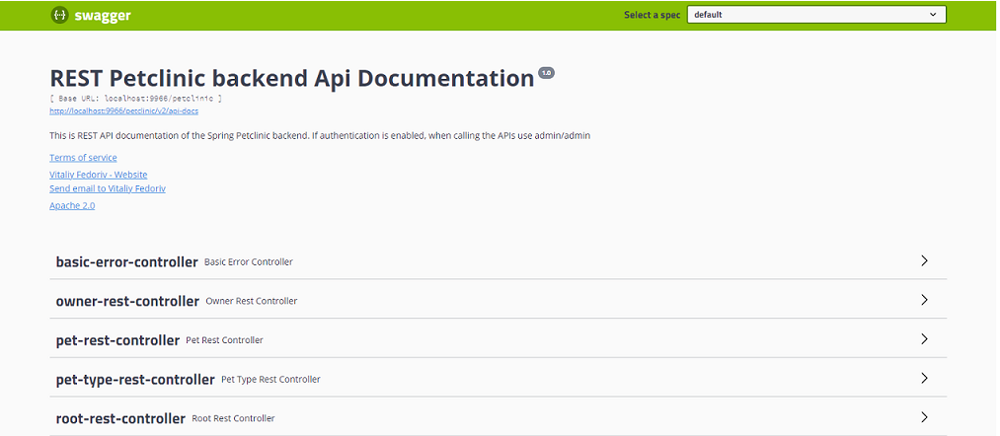
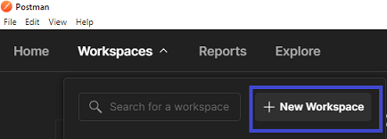
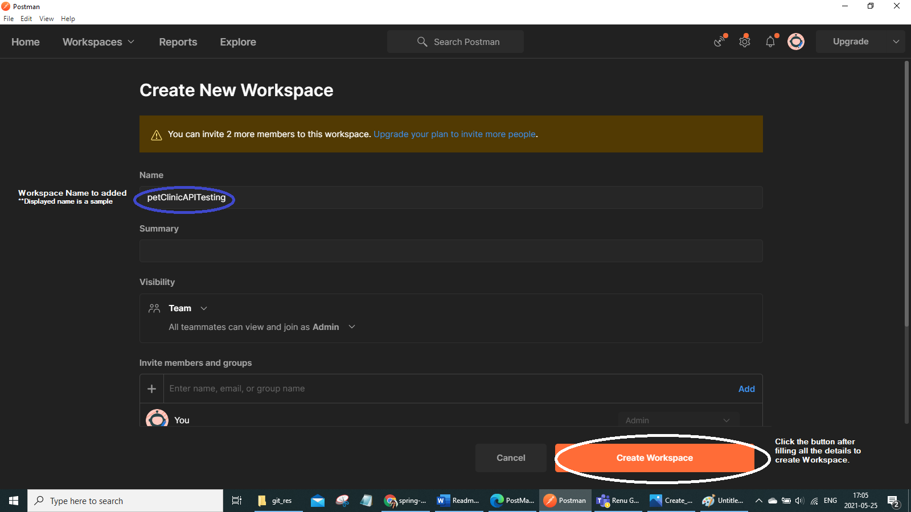
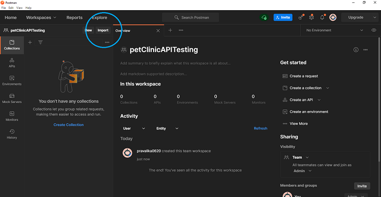
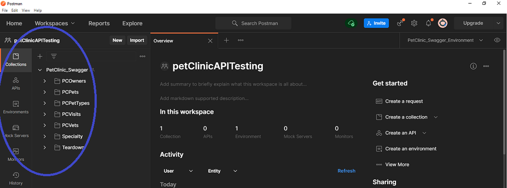
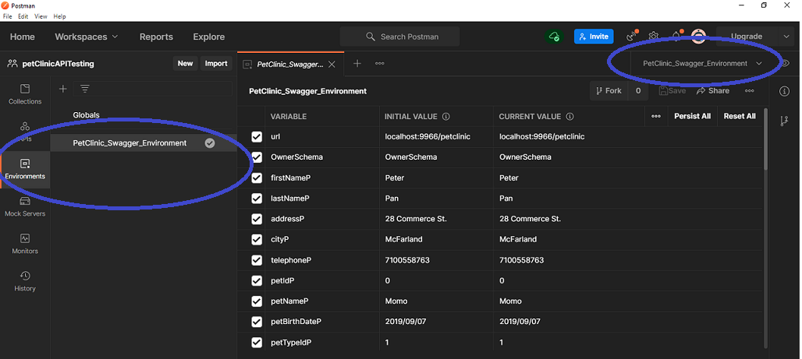
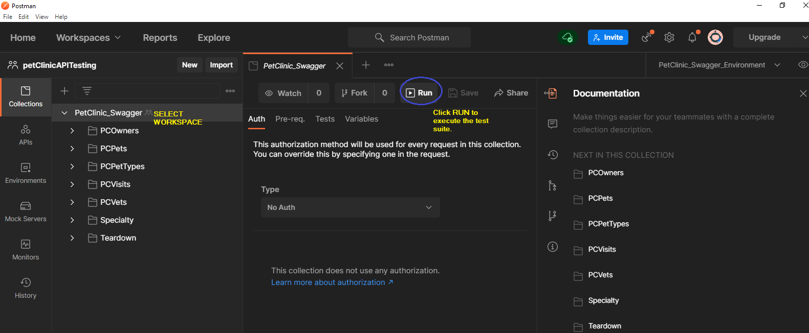

# PetClinic API testing using POSTMAN

## PetClinic_Environment.postman_environment.json :
This environment file consists of generic variables used across all the API test scenarios.

## Spring_PetClinic.postman_collection.json:
This collection file consists all postman test scripts for PetClinic APIs.

## Source code
### Prerequiste:
GIT should be installed and configured.

### Steps to clone the source:
1. Start command prompt

2. Set the location in command to clone the source (cd <source_location>)

3. Execute the following command

		git clone https://github.com/EbrosGaming/spring-petclinic-angular-and-rest-master.git

## Setup enviroment

**Start the Rest Service**

### Steps:
1. Start command prompt

2. Browse to source cloned location. (cd <source_location>)

3. Browse to ..cd <source_location>\spring-petclinic-rest-master\spring-petclinic-rest-master

4. Execute the following command

              maven spring-boot:run  ## not working? try using mvn spring-boot:run 

### Verify Swagger File:

Launch a browser and access the following URL :

 http://localhost:9966/petclinic/
 
 
 
 
 
 
	

	

## Postman configuration

### Prerequiste: 
Postman App or extension should be installed.

### Steps to configure Postman:
### 1. Launch Postman app

### 2. Create Postman workspace

 ### 2.1 : Click New workspace
 
 
 
 ### 2.2 : Provide details and create 
 
 
 
 ### 3. Import following files into workspace
 
 
 
 ## Files : 
 
	Spring_PetClinic.postman_collection.json
	PetClinic_Environment.postman_environment.json
	
 
 
 
 
 
 
 ### 4: Test Suite execution
 
 
 

	

